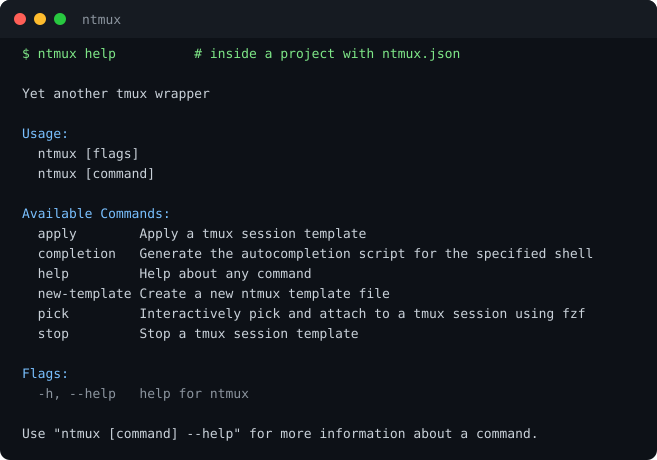

# ntmux

A declarative tmux session manager with a `tmux`-compatible CLI.



## Overview

**ntmux** is a Go-based CLI tool that wraps `tmux`:

- If you run it in a directory that contains `ntmux.json`, `ntmux.yaml`, or `ntmux.yml`, it applies that template.
- Otherwise, it behaves like `tmux` (pass-through), with a small convenience default: running `ntmux` with no args creates a new session named after your current directory.

> **⚠️ Development Status**: This project is currently in active development. APIs, commands, and configuration formats may change in future releases.

### Key Features

- **Declarative configuration**: Define sessions, windows, and startup commands in JSON/YAML
- **Safe re-runs (session-level)**: Existing sessions are skipped (ntmux does not reconcile/update them)
- **Template System**: Create reusable templates for different projects or workflows
- **Fast apply**: Batches multiple tmux operations into a single `tmux` invocation
- **Editor schema support (JSON)**: `schema.json` enables IDE autocomplete/validation (no runtime schema validation)
- **tmux compatibility**: If the first argument isn’t an `ntmux` subcommand, arguments are passed through to `tmux`

## Requirements

- **Go 1.23.4+** (for building from source)
- **tmux** (must be installed and available in PATH)
- **A shell**:
  - On Unix, ntmux uses `$SHELL` (falls back to `/bin/sh`).
  - On Windows, you’ll typically want to run under WSL, or ensure `$SHELL` points to `pwsh`/PowerShell.

## Installation

### Using Go Install

```bash
go install github.com/coeeter/ntmux@latest
```

### Build from Source

```bash
# Clone the repository
git clone https://github.com/coeeter/ntmux.git
cd ntmux

# Install using Make (installs to $(go env GOPATH)/bin)
make install

# Or build to ./tmp/ntmux
make build
```

### Verify Installation

```bash
ntmux --help
```

## Quick Start

### 1. Create a config file

Create `ntmux.json` in your project directory:

```json
{
  "$schema": "https://raw.githubusercontent.com/coeeter/ntmux/main/schema.json",
  "sessions": [
    {
      "name": "my-project",
      "default": true,
      "windows": [
        {
          "name": "editor",
          "cmd": "nvim .",
          "default": true
        },
        {
          "name": "terminal"
        },
        {
          "name": "server",
          "cmd": "npm run dev"
        }
      ]
    }
  ]
}
```

### 2. Apply it

```bash
# If ntmux.json or ntmux.yaml exists in the current directory
ntmux

# Or explicitly specify the file
ntmux apply ntmux.json
```

### 3. You’re done

ntmux will create any missing sessions from the template and attach to the default session.

## Configuration

### File Formats

ntmux supports both JSON and YAML formats:

- **Auto-discovered** (when running `ntmux` with no args): `ntmux.json`, `ntmux.yaml`, `ntmux.yml` (checked in that order)
- **Supported when passed explicitly**: `.json`, `.yaml`, `.yml`

### Configuration Schema

```json
{
  "$schema": "https://raw.githubusercontent.com/coeeter/ntmux/main/schema.json",
  "sessions": [
    {
      "name": "session-name",
      "dir": "/path/to/directory",
      "default": true,
      "windows": [
        {
          "name": "window-name",
          "dir": "/path/to/directory",
          "cmd": "command to run",
          "default": true
        }
      ]
    }
  ]
}
```

### Configuration Fields

#### Session Fields

| Field     | Type    | Required | Description                                       |
| --------- | ------- | -------- | ------------------------------------------------- |
| `name`    | string  | Yes      | Unique identifier for the tmux session            |
| `dir`     | string  | No       | Working directory (defaults to current directory) |
| `default` | boolean | No       | If true, attach to this session on startup        |
| `windows` | array   | Yes      | Array of window configurations                    |

#### Window Fields

| Field     | Type    | Required | Description                                     |
| --------- | ------- | -------- | ----------------------------------------------- |
| `name`    | string  | Yes      | Name of the window                              |
| `dir`     | string  | No       | Window-specific working directory               |
| `cmd`     | string  | No       | Command to execute when window opens            |
| `default` | boolean | No       | If true, select this window when session starts |

### Default Behavior

- **Default session**: If no session has `default: true`, the first session is treated as default (ntmux will attach to it).
- **Default window**: If no window has `default: true`, the first window is selected.
- **At least one window per session**: Each session must define at least one window (ntmux uses the first window to create the session).
- **Directory resolution**:
  - If a session `dir` is omitted, it defaults to your current working directory.
  - If a window `dir` is omitted, it defaults to the session `dir`.
  - Relative `dir` paths are resolved relative to your current working directory (not relative to the session `dir`).
  - `~` is not expanded (use an absolute path or rely on your shell).

## Usage

### Commands

#### `ntmux` (no args)

```bash
# If ntmux.json, ntmux.yaml, or ntmux.yml exists in current directory, apply it:
ntmux
```

When run with no arguments:

- If `ntmux.json`, `ntmux.yaml`, or `ntmux.yml` exists in the current directory, ntmux applies it.
- Otherwise, ntmux runs `tmux new-session -s <current-directory-name>`.

#### Apply configuration (`apply`)

```bash
# Apply default configuration file
ntmux apply

# Apply specific configuration file
ntmux apply path/to/template.json
ntmux apply path/to/template.yaml
ntmux apply path/to/template.yml
```

#### Stop sessions (`stop`)

```bash
# Kill all sessions defined in the template (if they exist)
ntmux stop

# Or explicitly specify the file
ntmux stop path/to/template.json
```

#### Generate a new template (`new-template`)

```bash
# Generate JSON template (default)
ntmux new-template

# Generate YAML template
ntmux new-template --format yaml
ntmux new-template -f yaml
```

The `new-template` command will:

1. Check for custom templates in `~/.config/ntmux/template.{json,yaml,yml}`
2. Use custom template if found, otherwise use built-in defaults
3. Create `ntmux.json` or `ntmux.yaml` in the current directory (fails if it already exists)

#### Shell completion (`completion`)

ntmux ships Cobra’s default completion command:

```bash
ntmux completion zsh
ntmux completion bash
ntmux completion fish
ntmux completion powershell
```

#### Pass-through to tmux

```bash
# If the first argument isn't an ntmux subcommand, args are passed to tmux
ntmux list-sessions
ntmux attach -t my-session
ntmux kill-session -t old-session
```

#### Help

```bash
# Show combined ntmux and tmux help
ntmux --help
ntmux -h
```

## Examples

### Basic Project Setup

```json
{
  "$schema": "https://raw.githubusercontent.com/coeeter/ntmux/main/schema.json",
  "sessions": [
    {
      "name": "my-app",
      "windows": [
        {
          "name": "editor",
          "cmd": "nvim .",
          "default": true
        },
        {
          "name": "terminal"
        }
      ]
    }
  ]
}
```

### Full-Stack Development Environment

```json
{
  "$schema": "https://raw.githubusercontent.com/coeeter/ntmux/main/schema.json",
  "sessions": [
    {
      "name": "fullstack",
      "default": true,
      "windows": [
        {
          "name": "backend",
          "dir": "./server",
          "cmd": "npm run dev",
          "default": true
        },
        {
          "name": "frontend",
          "dir": "./client",
          "cmd": "npm start"
        },
        {
          "name": "database",
          "cmd": "docker-compose up postgres"
        },
        {
          "name": "logs",
          "cmd": "tail -f ./logs/app.log"
        }
      ]
    }
  ]
}
```

### Multi-Project Workspace

```json
{
  "$schema": "https://raw.githubusercontent.com/coeeter/ntmux/main/schema.json",
  "sessions": [
    {
      "name": "api",
      "dir": "~/projects/api",
      "default": true,
      "windows": [
        {
          "name": "code",
          "cmd": "nvim .",
          "default": true
        },
        {
          "name": "server",
          "cmd": "go run main.go"
        }
      ]
    },
    {
      "name": "frontend",
      "dir": "~/projects/web",
      "windows": [
        {
          "name": "code",
          "cmd": "code ."
        },
        {
          "name": "dev",
          "cmd": "npm run dev"
        }
      ]
    }
  ]
}
```

### YAML Configuration Example

```yaml
sessions:
  - name: my-project
    dir: ~/projects/awesome-app
    default: true
    windows:
      - name: editor
        cmd: nvim .
        default: true
      - name: terminal
      - name: server
        cmd: npm run dev
```

## Advanced Usage

### Custom Template Location

Create a custom template that will be used by `ntmux new-template`:

```bash
# Create config directory
mkdir -p ~/.config/ntmux

# Create your custom template
cat > ~/.config/ntmux/template.json << 'EOF'
{
  "$schema": "https://raw.githubusercontent.com/coeeter/ntmux/main/schema.json",
  "sessions": [
    {
      "name": "project",
      "windows": [
        {
          "name": "nvim",
          "cmd": "nvim .",
          "default": true
        },
        {
          "name": "shell"
        },
        {
          "name": "git",
          "cmd": "git status"
        }
      ]
    }
  ]
}
EOF
```

Now `ntmux new-template` will use your custom template.

### Idempotent Sessions

ntmux checks if a session already exists before creating it:

```bash
# First run: creates sessions
ntmux apply

# Second run: skips existing sessions (no duplicates, no updates)
ntmux apply
```

If you change windows/commands for an existing tmux session, ntmux will not update that session; you’ll need to kill it first (or create a new session name).

### Shell-Specific Commands

ntmux uses your `$SHELL` (Unix) to wrap window commands and keep the window interactive after the command finishes:

- **Unix shells**: Commands wrapped with `shell -c 'cmd; exec shell'`
- **PowerShell**: Commands wrapped with `pwsh -NoExit -Command "& {cmd}"`
- **cmd.exe**: Commands wrapped with `cmd /K "cmd"`

### JSON Schema Benefits

The `$schema` field enables:

- IDE autocomplete for configuration fields
- Real-time validation in editors like VS Code
- Inline documentation for field descriptions

## Development

### Available Make Targets

```bash
make help              # Show available targets
make build             # Build binary to ./tmp/ntmux
make install           # Install to $GOPATH/bin/ntmux
make uninstall         # Remove from $GOPATH/bin
make test              # Run tests
make test-verbose      # Run tests with verbose output
make test-cover        # Generate coverage report
make clean             # Remove build artifacts
make run ARGS="args"   # Run with arguments
make fmt               # Format code with go fmt
make vet               # Run go vet
make deps              # Download dependencies
make tidy              # Tidy go.mod and go.sum
make check             # Run fmt, vet, and tests
make generate-schema   # Regenerate schema.json
```

## Contributing

Contributions are welcome! Here's how you can help:

### Reporting Issues

1. Check existing issues to avoid duplicates
2. Provide clear description of the problem
3. Include steps to reproduce
4. Share your configuration file (if applicable)
5. Include tmux and ntmux versions

### Submitting Pull Requests

1. Fork the repository
2. Create a feature branch (`git checkout -b feature/amazing-feature`)
3. Make your changes
4. Run quality checks (`make check`)
5. Commit your changes (`git commit -m 'Add amazing feature'`)
6. Push to the branch (`git push origin feature/amazing-feature`)
7. Open a Pull Request

### Development Setup

```bash
# Clone your fork
git clone https://github.com/your-username/ntmux.git
cd ntmux

# Install dependencies
make deps

# Build and test
make build
make test

# Install locally for testing
make install
```

### Code Guidelines

- Follow Go best practices and idioms
- Add tests for new features
- Update documentation for user-facing changes
- Run `make check` before committing
- Keep commits focused and atomic

## Troubleshooting

### tmux not found

**Error**: `exec: "tmux": executable file not found in $PATH`

**Solution**: Install tmux using your package manager:

```bash
# macOS
brew install tmux

# Ubuntu/Debian
sudo apt-get install tmux

# Fedora
sudo dnf install tmux

# Arch Linux
sudo pacman -S tmux
```

### Session already exists

ntmux automatically skips existing sessions. To recreate a session:

```bash
# Kill the existing session first
tmux kill-session -t session-name

# Then apply your configuration
ntmux apply
```

### Commands not executing

Ensure your commands are properly quoted in JSON:

```json
{
  "cmd": "echo 'hello world'" // Correct
}
```

For complex commands, use shell scripts:

```json
{
  "cmd": "./scripts/setup.sh"
}
```

### IDE not recognizing schema

Ensure the `$schema` field is at the top of your configuration:

```json
{
  "$schema": "https://raw.githubusercontent.com/coeeter/ntmux/main/schema.json",
  "sessions": [...]
}
```

VS Code should automatically fetch the schema. For other editors, check their JSON schema configuration.

### `~` paths don't work as expected

ntmux does not expand `~` in `dir` fields. Use absolute paths or keep paths relative to the directory you run `ntmux` from.

## License

[MIT](./LICENSE)

## Author

Created by [Coeeter](https://github.com/coeeter)

## Acknowledgments

- Built with [Cobra](https://github.com/spf13/cobra) for CLI framework
- Uses [invopop/yaml](https://github.com/invopop/yaml) for YAML support
- JSON Schema generation via [invopop/jsonschema](https://github.com/invopop/jsonschema)

---
